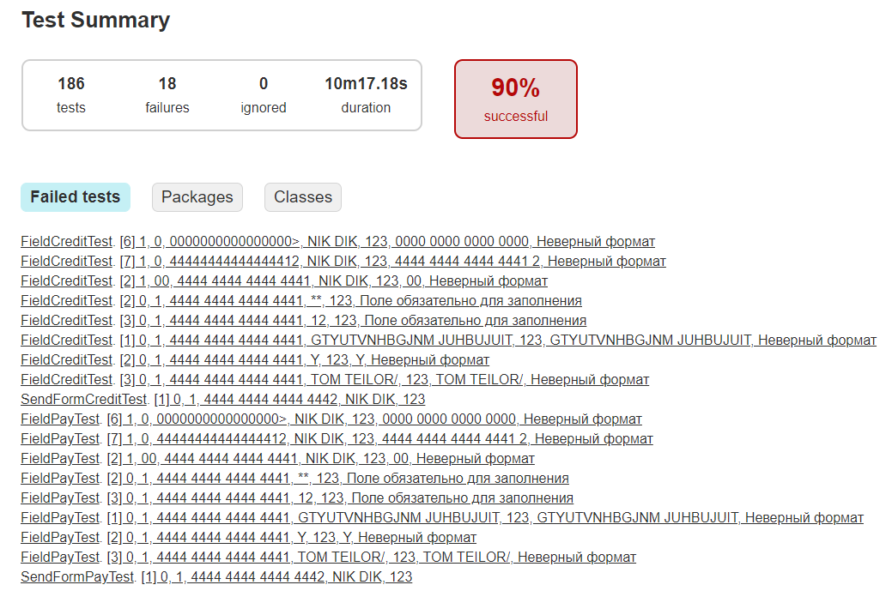
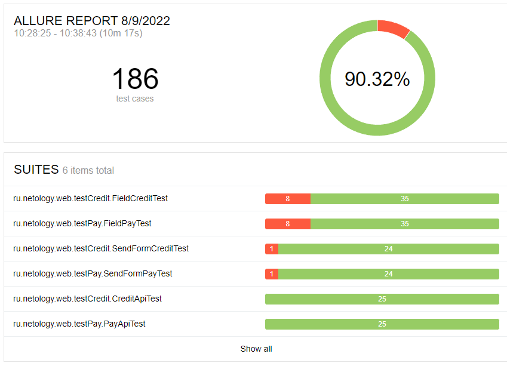
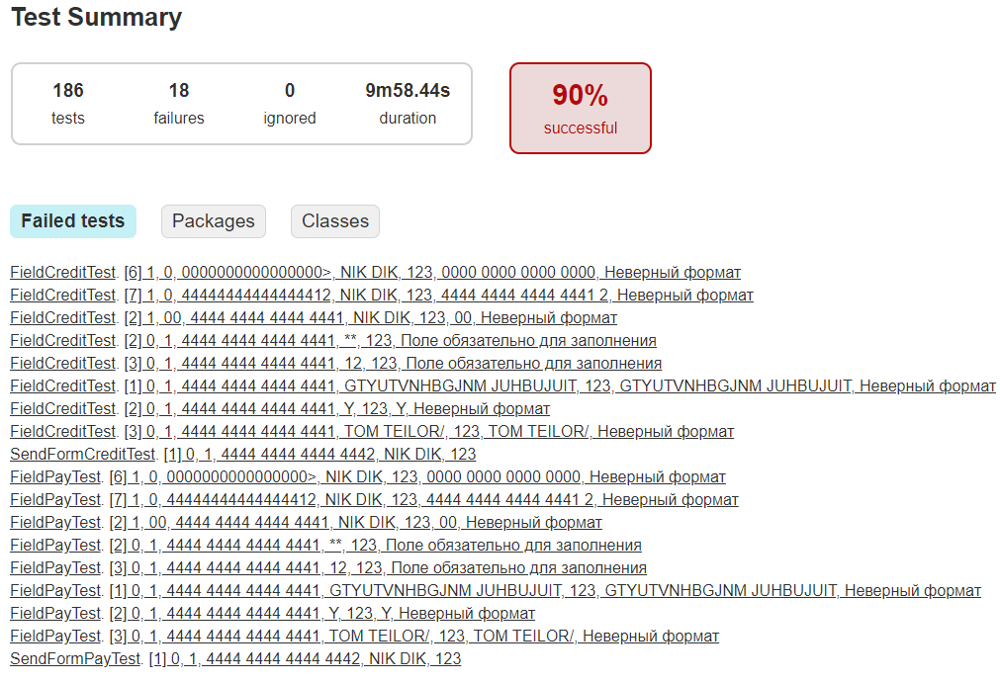
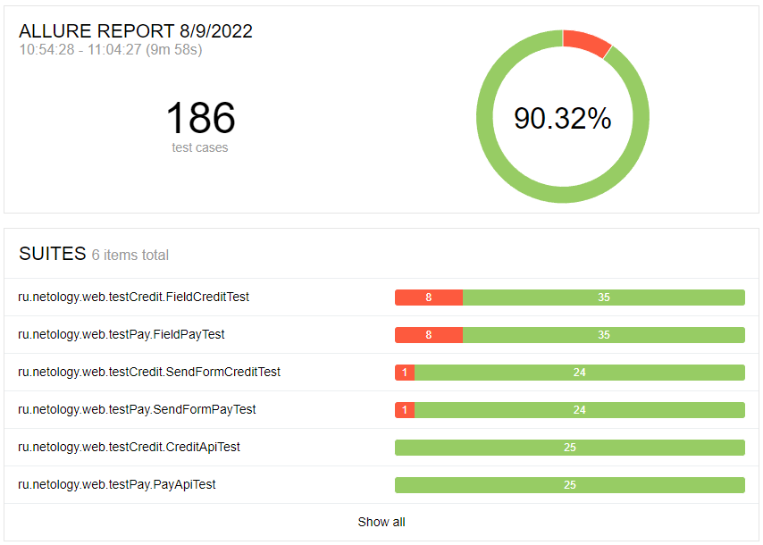

**Описание проекта**

Выполнено тестирование приложения, позволяющего купить тур двумя способами:
- оплата по дебетовой карте;
- выдача кредита по данным банковской карты.

В рамках тестирования выполнены проверки работы приложения с банковскими сервисами:
 - сервис платежей (Payment Gate),
 - кредитный сервис (Credit Gate).

А также взаимодействие с базами данных (в части выполнения записи в базу данных при выполнении операции):
 - MySQL,
 - PostgreSQL.

Разработаны:

|Купить  |  Купить в кредит | Описание| 
|-------|:---:|-----:|
|FieldPayTest.java|FieldCreditTest.java|Проверка работы полей формы|
|PayApiTest.java|CreditApiTest.java|Проверка работы API банка и корректности работы базы данных|
|SendFormPayTest.java|SendFormCreditTest.java|Проверка отправки формы, получения сообщений от банка, корректности работы базы данных|

Всего тест-кейсов - 186

% успешных - 90,32%

% не успешных - 9,68%

Рисунок 1 - Отчет Gradle, база данных MySQL

Рисунок 2 - Отчет Allure, база данных MySQL

Рисунок 3 - Отчет Gradle, база данных Postgre

Рисунок 4 - Отчет Allure, база данных Postgre

Общие рекомендации:
1. Откорректировать дизайн в части: 
 - наименование тура;
 - подсветки кнопок;
 - грамматических ошибок в информационных окнах.
2. Определить требования к полю "Владелец карты" (для вкладок "Купить" и "Купить в кредит"), откорректировать в соответствии с требованиями;
3. Откорректировать получение сообщения от банка (для вкладок "Купить" и "Купить в кредит") при внесении значений "Отклоненной" карты.

Перечень багов - см. https://github.com/Veragenp/006_QA_Diploma_v1/issues
