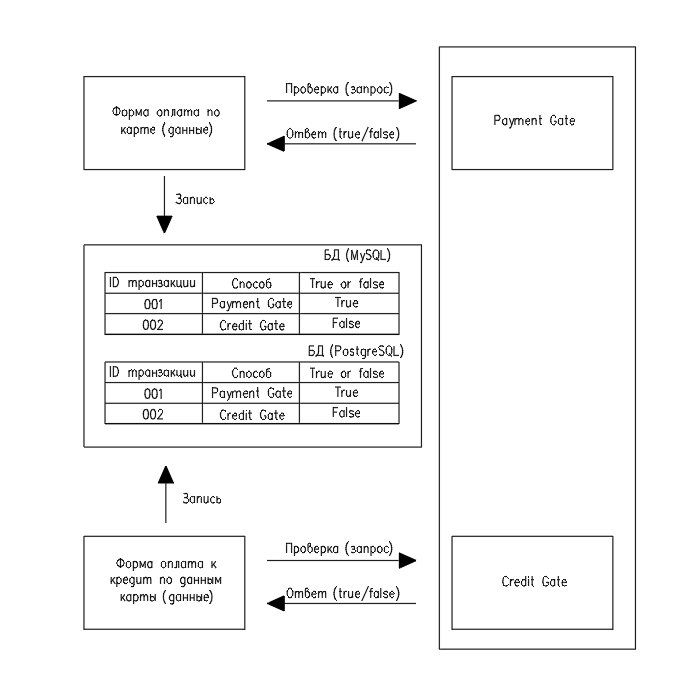

**План тестирования формы покупки тура**

**Цель:** Тестирование формы покупки тура для следующих вариантов:
- покупка тура с оплатой банковской картой;
- покупка тура в кредит с использованием данных банковских карт.

**Структурная схема тестируемого проекта**

**План разработки проекта**
1. Подготовка работы над проектом:
   - анализ технического задания;
   - подключить СУБД MySQL, PostgreSQL;
   - запустить приложение aqa-shop.jar на порту 8080;
   - подключить симулятор банковских карт gate-simulator, для этого подключить Docker-образ (https://nodejs.org/ru/docs/guides/nodejs-docker-webapp/);
   - подключение необходимых фреймворков и плагинов.
2. Составление плана автоматизации;
3. Автоматизация (разработка автотестов):
   - разработка логических диаграмм методов;
   - написание кода.
4. Подготовка отчетных документов по итогам автоматизации тестирования;
5. Подготовка отчетных документов по итогам автоматизации.

Таблица 1 - Интервальная оценка/сроки разработки проекта

|Этап               | Срок разработки | Кол, ч| Отметка о выполнении|
|-------|:---:|-----:|-----:|
|1               | 24.06.22 | 8| Отметка о выполнении|
|2               | 24.06.22 | 12| Отметка о выполнении|
|3               | 06.07.22 | 32| Отметка о выполнении|
|4              | 07.07.22 | 8| Отметка о выполнении|
|5              | 08.07.22 | 6| Отметка о выполнении|

**Перечень используемых инструментов с обоснованием выбора**
1. Selenide - среда для автоматизированного тестирования веб-приложений. В данной задаче требуется протестировать
   web-сайт, тестируем с использованием инструментов Selenide;
2. Java 11 - используется для разработки автотестов;
3. Junit5 - выполняем тестирование web-сайта при помощи языка Java, данная среда предназначена для тестирования приложений Java;
4. Java-Faker - библиотека применена для создания тестовых данных: имя, телефон, электронная почта.
5. Gradle - так как в данном проекте используются различные библиотеки и фреймворки, требуется инструмент для сборки проекта. Данный инструмент применен для сборки проекта.
6. Allure - нужно проанализировать результаты тестирования, для этого используем фреймворк для создания отчетов.
7. IntelliJ IDEA - инструмент для работы с проектом;
8. Docker - для записи успешности/не успешности транзакций в базу данных;
9. Rest assured - так как имеется связь со сторонними системами.

**Перечень автоматизируемых сценариев**

_Сценарий 1.1 Переход на форму оформления карты_
1. Открыть сайт http://localhost:8080/;
2. Кликнуть на кнопку “Купить”;
3. Ожидаемый результат - форма “Оплата по карте”

_Сценарий 1.2 Переход на форму оформления карты_
1. Открыть сайт http://localhost:8080/;
2. Кликнуть на кнопку “Купить в кредит”;
3. Ожидаемый результат - форма “Кредит по данным карты”

_Сценарий 1.3 Переход на форму оформления карты_
1. Открыть сайт http://localhost:8080/;
2. Кликнуть на кнопку “Купить в кредит”;
3. Кликнуть на кнопку “Купить”;
4. Ожидаемый результат - форма “Оплата по карте”.

_Сценарий 1.4 Переход на форму оформления карты_
1. Открыть сайт http://localhost:8080/;
2. Кликнуть на кнопку “Купить”;
3. Кликнуть на кнопку “Купить в кредит”;
4. Ожидаемый результат - форма “Кредит по данным карты”.

_Сценарий 2.1 Тестирование отправки формы. Позитивное_

Таблица 1 - Валидные значения для тестирования отправки формы

|Владелец  | Номер карты | Месяц, y| Год, х |CVC/CVV|
|-------|:---:|-----:|-----:|-----:|
|GTYUTVNHBGJNM JUHBUJUI | 4444444444444441    | y+z   | х   |123|
|GTYUTVNHBGJN JUHBUJUI  |                     | y+z-1 | х+1 |000|
|IA T                   |                     | 01    | х+5 |   |
|Ivan Ivanov            |                     | 1     |     |   |
|kolya rik              |                     |  y    |     |   |
|TO   TE                |                     |       |     |   |

_х - текущий год_
_y - текущий месяц_
_z = 12-x_

_Сценарий 2.1.1 Тестирование отправки формы. Позитивное_
1. Выполнить сценарии 1.1 или 1.3;
2. Внести валидные значения в соответствии с таблицей 2.

   Таблица 2 - Сценарии заполнения формы

   |cardNumber  |  month | year| owner |CVC/CVV|
      |-------|:---:|-----:|-----:|-----:|
   |4444444444444441|	1	|х+1	|GTYUTVNHBGJN JUHBUJUI|	123|
   |4444444444444441|	y+z-1	|х	|IA T	|000|
   |4444444444444441|	01	|х+1	|GTYUTVNHBGJN JUHBUJUI	|000|
   |4444444444444441|	1	|х+1	|TO   TE|	000|
   |4444444444444441|	01	|х+1	|kolya rik|	123|
   |4444444444444441|	1	|х+1	|IA T	|123|
   |4444444444444441|	y+z-1	|х+5	|Ivan Ivanov|	123|
   |4444444444444441|	1	|х+1	|kolya rik|	000|
   |4444444444444441|	y+z	|х	|kolya rik|	123|
   |4444444444444441|	y	|х	|Ivan Ivanov|	000|
   |4444444444444441|	y+z	|х+5	|TO   TE|	000|
   |4444444444444441|	01	|х+1	|IA T	|123|
   |4444444444444441|	y+z	|х+5	|GTYUTVNHBGJN JUHBUJUI|	000|
   |4444444444444441|	y+z	|х+1	|Ivan Ivanov|	123|
   |4444444444444441|	1	|х+1	|GTYUTVNHBGJNM JUHBUJUI|	123|
   |4444444444444441|	01	|х+1	|Ivan Ivanov	|123|
   |4444444444444441|	y+z-1	|х+1	|GTYUTVNHBGJN JUHBUJUI|	000|
   |4444444444444441|	01	|х+1	|TO   TE|	123|
   |4444444444444441|	y	|х+5	|kolya rik|	123|
   |4444444444444441|	y	|х+1	|TO   TE|	000|
   |4444444444444441|	01	|х+1	|GTYUTVNHBGJNM JUHBUJUI|	000|
   |4444444444444441|	y+z-1|	х	|GTYUTVNHBGJNM JUHBUJUI|	000|
   |4444444444444441|	y+z	|х+5	|IA T	|000|
   |4444444444444441|	y	|х	|IA T|123|
   |4444444444444441|	y+z-1	|х	|kolya rik|	123|
   |4444444444444441|	y+z	|х+5	|GTYUTVNHBGJNM JUHBUJUI|	123|
   |4444444444444441|	y	|х	|GTYUTVNHBGJN JUHBUJUI|	123|
   |4444444444444441|	1	|х+1	|Ivan Ivanov|	123|
   |4444444444444441|	y+z-1	|х	|TO   TE|	000|
   |4444444444444441|	y	|х	|GTYUTVNHBGJNM JUHBUJUI	|123|

3. После внесения каждого варианта кликнуть по кнопке "Продолжить";
4. Ожидаемый результат - кнопка "Продолжить" нажимается, форма отправляется, сообщение от банка
   "Успешно Операция одобрена Банком." В ответе от симулятора - внесены данные по операции
   (Владелец, Номер карты, Месяц, Год, CVC/CVV), статус DECLINED. Запись в СУБД не выполнена.

_Сценарий 2.1.2 Тестирование отправки формы. Позитивное_
1. Выполнить сценарии 1.2 или 1.4;
2. Выполнить п. 2...4 сценария 2.1.1.

_Сценарий 2.3 Тестирование полей. Негативные сценарии_

Таблица 2.3 - Валидные значения

|cardNumber  |  month | year| owner |CVC/CVV|
   |-------|:---:|-----:|-----:|-----:|
|4444 4444 4444 4441|	y|	х+1	|NIK DIK|     123|

_Сценарий 2.3.1 Тестирование поля "Номер карты" для вкладки "Купить". Негативное_
1. Выполнить сценарии 1.1 или 1.3;
2. Внести в поле значения:
   - 444444444444444
   - 444444444444444Ч
   - 444444444444444L
   - 4444 4444 4444 444*
   - 4444 4444 4444 444>
   - 0000000000000000
3. Остальные поля формы заполнить валидными значениями, кликнуть по кнопке "Продолжить";
4. Ожидаемый результат - кнопка "Продолжить" нажимается, форма не отправляется, в поле значение 444444444444444,
   предупреждение "Неверный формат". В ответе от симулятора - запись отсутствует.

_Сценарий 2.3.2 Тестирование поля "Номер карты" для вкладки "Купить". Негативное_
1. Выполнить сценарии 1.1 или 1.3;
2. Внести в поле значения:
   - 44444444444444412
3. Остальные поля формы заполнить валидными значениями, кликнуть по кнопке "Продолжить";
4. Ожидаемый результат - кнопка "Продолжить" нажимается, форма не отправляется, в поле значение 44444444444444412,
   предупреждение "Неверный формат". В ответе от симулятора - запись отсутствует.

_Сценарий 2.3.3 Тестирование поля "Номер карты" для вкладки "Купить". Негативное_
1. Выполнить сценарии 1.1 или 1.3;
2. Внести в поле значения:
   - два пробела;
   - *
   - ег
   - dd
   - 1
3. Остальные поля формы заполнить валидными значениями, кликнуть по кнопке "Продолжить";
4. Ожидаемый результат - кнопка "Продолжить" нажимается, форма не отправляется, в поле пустое значение,
   предупреждение "Неверный формат". В ответе от симулятора - запись отсутствует.

_Сценарий 2.3.4 Тестирование поля "Месяц" для вкладки "Купить". Негативное_
1. Выполнить сценарии 1.1 или 1.3;
2. Внести в поле значения:
   - 00
3. Остальные поля формы заполнить валидными значениями, кликнуть по кнопке "Продолжить";
4. Ожидаемый результат - кнопка "Продолжить" нажимается, форма не отправляется, на экране под полем
   появляется сообщение "Неверный формат". В ответе от симулятора - запись отсутствует.

_Сценарий 2.3.5 Тестирование поля "Месяц" для вкладки "Купить". Негативное_
1. Выполнить сценарии 1.1 или 1.3;
2. Внести в поле значения:
   - 13
3. Остальные поля формы заполнить валидными значениями, кликнуть по кнопке "Продолжить";
4. Ожидаемый результат - кнопка "Продолжить" нажимается, форма не отправляется, на экране под полем
   появляется сообщение "Неверно указан срок действия карты". В ответе от симулятора - запись отсутствует.

_Сценарий 2.3.6 Тестирование поля "Месяц" для вкладки "Купить". Негативное_
1. Выполнить сценарии 1.1 или 1.3;
2. Внести в поле значения:
   - ии
   - hj
   - Е
   - *
   - %
   - 2 пробела
3. Остальные поля формы заполнить валидными значениями, кликнуть по кнопке "Продолжить";
4. Ожидаемый результат - кнопка "Продолжить" нажимается, форма не отправляется, поле пустое, на экране
   под полем появляется сообщение "Неверный формат". В ответе от симулятора - запись отсутствует.

_Сценарий 2.3.7 Тестирование поля "Год" для вкладки "Купить". Негативное_

_х - текущий год_
1. Выполнить сценарии 1.1 или 1.3;
2. Внести в поле значения:
   - х-1
   - 00
3. Остальные поля формы заполнить валидными значениями, кликнуть по кнопке "Продолжить";
4. Ожидаемый результат - кнопка "Продолжить" нажимается, форма не отправляется, на экране под полем
   появляется сообщение "Истек срок действия карты". В ответе от симулятора - запись отсутствует.

_Сценарий 2.3.8 Тестирование поля "Год" для вкладки "Купить". Негативное_

_х - текущий год_
1. Выполнить сценарии 1.1 или 1.3;
2. Внести в поле значения:
   - х+6
3. Остальные поля формы заполнить валидными значениями, кликнуть по кнопке "Продолжить";
4. Ожидаемый результат - кнопка "Продолжить" нажимается, форма не отправляется, на экране под
   полем появляется сообщение "Неверно указан срок действия карты". В ответе от симулятора - запись отсутствует.

_Сценарий 2.3.9 Тестирование поля "Год" для вкладки "Купить". Негативное_

_х - текущий год_
1. Выполнить сценарии 1.1 или 1.3;
2. Внести в поле значения:
   - два пробела
   - лл
   - DS
   - *
   - %
3. Остальные поля формы заполнить валидными значениями, кликнуть по кнопке "Продолжить";
4. Ожидаемый результат - кнопка "Продолжить" нажимается, форма не отправляется, поле не заполнено,
   на экране под полем появляется сообщение "Неверный формат". В ответе от симулятора - запись отсутствует.

_Сценарий 2.3.10 Тестирование поля "CVC/CVV" для вкладки "Купить". Негативное_
1. Выполнить сценарии 1.1 или 1.3;
2. Внести в поле значения:
   - 1
3. Остальные поля формы заполнить валидными значениями, кликнуть по кнопке "Продолжить";
4. Ожидаемый результат - кнопка "Продолжить" нажимается, форма не отправляется, в поле значение 1,
   на экране под полем появляется сообщение "Неверный формат". В ответе от симулятора - запись отсутствует.

_Сценарий 2.3.11 Тестирование поля "CVC/CVV" для вкладки "Купить". Негативное_
1. Выполнить сценарии 1.1 или 1.3;
2. Внести в поле значения:
   - два пробела
   - sdd
   - выа
   - ***
   - %%%
3. Остальные поля формы заполнить валидными значениями, кликнуть по кнопке "Продолжить";
4. Ожидаемый результат - кнопка "Продолжить" нажимается, форма не отправляется, поле пустое, на экране
   под полем появляется сообщение "Неверный формат". В ответе от симулятора - запись отсутствует.

_Сценарий 2.3.12 Тестирование поля "Владелец" для вкладки "Купить". Негативное_

_(максимальная длина поля - 22 символа с учетом пробела)_
1. Выполнить сценарии 1.1 или 1.3;
2. Внести в поле значения:
   - GTYUTVNHBGJNM JUHBUJUIT
   - Y
   - **
   - 12
   - TOM TEILOR/
3. Остальные поля формы заполнить валидными значениями, кликнуть по кнопке "Продолжить";
4. Ожидаемый результат - в поле внесено значение без символов, кнопка "Продолжить" нажимается, форма не отправляется,
   на экране под полем появляется сообщение "Неверный формат". В ответе от симулятора - запись отсутствует.

_Сценарий 2.3.13 Тестирование поля "Владелец" для вкладки "Купить". Негативное_
1. Выполнить сценарии 1.1 или 1.3;
2. Внести в поле значения:
   - два пробела
3. Остальные поля формы заполнить валидными значениями, кликнуть по кнопке "Продолжить";
4. Ожидаемый результат - в поле внесено значение без символов, кнопка "Продолжить" нажимается, форма не отправляется,
   на экране под полем появляется сообщение "Поле обязательно для заполнения". В ответе от симулятора - запись отсутствует.

_Сценарий 2.3.14  Тестирование полей "Месяц", "Год" для вкладки "Купить". Негативное_

_х - текущий год_,
_y - текущий месяц_
1. Выполнить сценарии 1.1 или 1.3;
2. Внести в поле "год" значение: х;
3. Внести в поле "Месяц" значение: y-1;
4. Остальные поля формы заполнить валидными значениями, кликнуть по кнопке "Продолжить";
5. Ожидаемый результат - кнопка "Продолжить" нажимается, форма не отправляется, на экране под полем появляется
   сообщение "Неверно указан срок действия карты". В ответе от симулятора - запись отсутствует.

_Сценарий 2.3.15  Тестирование полей "Месяц", "Год" для вкладки "Купить". Негативное_

_х - текущий год_,
_y - текущий месяц_
1. Выполнить сценарии 1.1 или 1.3;
2. Внести в поле "год" значение: х;
3. Внести в поле "Месяц" значение: y-2;
4. Остальные поля формы заполнить валидными значениями, кликнуть по кнопке "Продолжить";
5. Ожидаемый результат - кнопка "Продолжить" нажимается, форма не отправляется, на экране под полем появляется
   сообщение "Неверно указан срок действия карты". В ответе от симулятора - запись отсутствует.

_2.4 Тестирование отправки формы. Негативное_
_Сценарий 2.4.1 Тестирование отправки формы. Негативное_
1. Выполнить сценарии 1.1 или 1.3;
2. Внести валидные значения в соответствии с таблицей.

   |cardNumber  |  month | year| owner |CVC/CVV|
            |-------|:---:|-----:|-----:|-----:|
   |4444 4444 4444 4442|	y|	х+1	|NIK DIK|     123|

3. Ожидаемый результат - кнопка "Продолжить" нажимается, форма отправляется, сообщение от банка
   "Ошибка Ошибка! Банк отказал в проведении операции." В ответе от симулятора - внесены данные по операции
   (Владелец, Номер карты, Месяц, Год, CVC/CVV), статус DECLINED. Выполнена запись в СУБД: ID, Payment Gate, False.

_Сценарий 2.4.2 Тестирование отправки формы. Негативное_
1. Выполнить сценарии 1.2 или 1.4;
2. Внести валидные значения в соответствии с таблицей.

   |cardNumber  |  month | year| owner |CVC/CVV|
         |-------|:---:|-----:|-----:|-----:|
   |4444 4444 4444 4442|	y|	х+1	|NIK DIK|     123|

3. Ожидаемый результат - кнопка "Продолжить" нажимается, форма отправляется, сообщение от банка
   "Ошибка Ошибка! Банк отказал в проведении операции." В ответе от симулятора - внесены данные по операции
   (Владелец, Номер карты, Месяц, Год, CVC/CVV), статус DECLINED. Выполнена запись в СУБД: ID, Credit Gate, False.

**Перечень и описание возможных рисков при автоматизации**
1. Автотесты проверяют только то на что запрограммирован, в случае не учета какого-либо сценария, подобный сценарий покрыт не будет;
2. В случае изменения наполнения страницы, добавления каких-либо дополнительных полей потребуется корректировка тестов, постоянная поддержка тестов;
3. Не верная оценка трудозатрат на автотестировании;
4. Трудности при поиске локаторов элементов на страницах. Риски, связанные с изменением структуры сайта и последующей корректировкой локаторов;
5. Риски, связанные с компетенцией специалиста.

