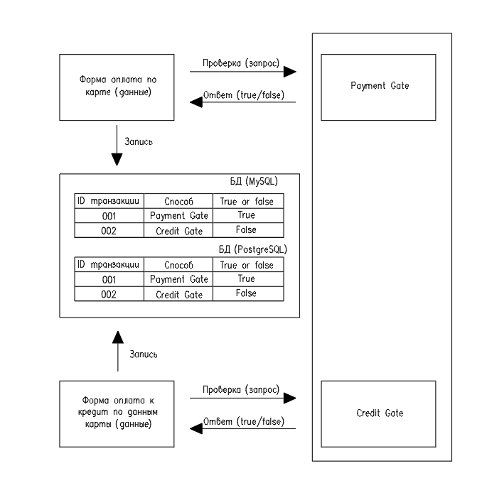

**План тестирования формы покупки тура**

**Цель:** Тестирование формы покупки тура для следующих вариантов:
 - покупка тура с оплатой банковской картой;
 - покупка тура в кредит с использованием данных банковских карт.

**Структурная схема тестируемого проекта** 
   

**План разработки проекта**
1. Подготовка работы над проектом:
    - анализ технического задания;
    - подключить СУБД MySQL, PostgreSQL;
    - запустить приложение aqa-shop.jar на порту 8080;
    - подключить симулятор банковских карт gate-simulator, для этого подключить Docker-образ (https://nodejs.org/ru/docs/guides/nodejs-docker-webapp/);
    - подключение необходимых фреймворков и плагинов;
    - работа с API.
2. Составление плана автоматизации;
3. Автоматизация (разработка автотестов);
4. Подготовка отчетных документов по итогам автоматизации тестирования;
5. Подготовка отчетных документов по итогам автоматизации.
   

Таблица 1 - Интервальная оценка/сроки разработки проекта

|Этап               | Срок разработки | Кол, ч| Отметка о выполнении|
|-------|:---:|-----:|-----:|
|1               | 24.06.22 | 8| Отметка о выполнении|
|2               | 23.06.22 | 12| Отметка о выполнении|
|3               | 05.07.22 | 32| Отметка о выполнении|
|4              | 06.07.22 | 8| Отметка о выполнении|
|5              | 07.07.22 | 6| Отметка о выполнении|

**Перечень используемых инструментов с обоснованием выбора**
1. Selenide - среда для автоматизированного тестирования веб-приложений. В данной задаче требуется протестировать
   web-сайт, тестируем с использованием инструментов Selenide;
2. Java 11 - используется для разработки автотестов;
3. Junit5 - выполняем тестирование web-сайта при помощи языка Java, данная среда предназначена для тестирования приложений Java;
4. Java-Faker - библиотека применена для создания тестовых данных: имя, телефон, электронная почта.
5. Gradle - так как в данном проекте используются различные библиотеки и фреймворки, требуется инструмент для сборки проекта. Данный инструмент применен для сборки проекта.
6. Allure - нужно проанализировать результаты тестирования, для этого используем фреймворк для создания отчетов.
7. IntelliJ IDEA - инструмент для работы с проектом;
8. Docker - для записи успешности/не успешности транзакций в базу данных;
9. Rest assured - так как имеется связь со сторонними системами.

**Перечень автоматизируемых сценариев**
_Сценарий 1.1 Переход на форму оформления карты_
1. Открыть сайт http://localhost:8080/;
2. Кликнуть на кнопку “Купить”;
3. Ожидаемый результат - форма “Оплата по карте”

Сценарий 1.2 Переход на форму оформления карты
1. Открыть сайт http://localhost:8080/;
2. Кликнуть на кнопку “Купить в кредит”;
3. Ожидаемый результат - форма “Кредит по данным карты”

Сценарий 1.3 Переход на форму оформления карты
1. Открыть сайт http://localhost:8080/;
2. Кликнуть на кнопку “Купить в кредит”;
3. Кликнуть на кнопку “Купить”;
4. Ожидаемый результат - форма “Оплата по карте”.

Сценарий 1.4 Переход на форму оформления карты
1. Открыть сайт http://localhost:8080/;
2. Кликнуть на кнопку “Купить”;
3. Кликнуть на кнопку “Купить в кредит”;
4. Ожидаемый результат - форма “Кредит по данным карты”.

Сценарий 2.1.1 Тестирование поля "Номер карты" для вкладки "Купить". Позитивное
1. Выполнить сценарии 1.1 или 1.3;
2. Внести в поле значения:
    - 4444444444444441
    - 4444 4444 4444 4441
    - 4444-4444-4444-4441
    - 4444_4444_4444_4441
3. Остальные поля формы заполнить валидными значениями, кликнуть по кнопке "Продолжить";
4. Ожидаемый результат - кнопка "Продолжить" нажимается, форма отправляется, на экране под полем появляется сообщение о статусе отправки.

Сценарий 2.1.2 Тестирование поля "Номер карты" для вкладки "Купить". Негативное
1. Выполнить сценарии 1.1 или 1.3;
2. Внести в поле значения:
   - 444444444444444
   - 444444444444444Ч
   - 444444444444444L
   - 4444 4444 4444 444*
   - 4444 4444 4444 444>
3. Остальные поля формы заполнить валидными значениями, кликнуть по кнопке "Продолжить";
4. Ожидаемый результат - кнопка "Продолжить" нажимается, форма не отправляется, в поле значение 444444444444444, предупреждение "Неверный формат".

Сценарий 2.1.3 Тестирование поля "Номер карты" для вкладки "Купить". Негативное
1. Выполнить сценарии 1.1 или 1.3;
2. Внести в поле значения:
   - 44444444444444412
3. Остальные поля формы заполнить валидными значениями, кликнуть по кнопке "Продолжить";
4. Ожидаемый результат - кнопка "Продолжить" нажимается, форма не отправляется, в поле значение 44444444444444412, предупреждение "Неверный формат".

Сценарий 2.1.4 Тестирование поля "Номер карты" для вкладки "Купить". Негативное
1. Выполнить сценарии 1.1 или 1.3;
2. Внести в поле значения:
   - два пробела;    
   - *
   - ег
   - dd
   - 1
3. Остальные поля формы заполнить валидными значениями, кликнуть по кнопке "Продолжить";
4. Ожидаемый результат - кнопка "Продолжить" нажимается, форма не отправляется, в поле пустое значение, предупреждение "Неверный формат".

Сценарий 2.2.1 Тестирование поля "Месяц" для вкладки "Купить". Позитивное
1. Выполнить сценарии 1.1 или 1.3;
2. Внести в поле значения:
   - 12
   - 11
   - 1
3. Остальные поля формы заполнить валидными значениями, кликнуть по кнопке "Продолжить";
4. Ожидаемый результат - кнопка "Продолжить" нажимается, форма отправляется, на экране под полем появляется сообщение о статусе отправки.

Сценарий 2.2.2 Тестирование поля "Месяц" для вкладки "Купить". Позитивное
1. Выполнить сценарии 1.1 или 1.3;
2. Внести в поле значения:
   - -1
3. Остальные поля формы заполнить валидными значениями, кликнуть по кнопке "Продолжить";
4. Ожидаемый результат - в поле значение 1, кнопка "Продолжить" нажимается, форма отправляется, на экране под полем появляется сообщение о статусе отправки.

Сценарий 2.2.3 Тестирование поля "Месяц" для вкладки "Купить". Негативное
1. Выполнить сценарии 1.1 или 1.3;
2. Внести в поле значения:
   - 0
3. Остальные поля формы заполнить валидными значениями, кликнуть по кнопке "Продолжить";
4. Ожидаемый результат - кнопка "Продолжить" нажимается, форма не отправляется, на экране под полем появляется сообщение "Неверный формат".

Сценарий 2.2.4 Тестирование поля "Месяц" для вкладки "Купить". Негативное
1. Выполнить сценарии 1.1 или 1.3;
2. Внести в поле значения:
   - 13
3. Остальные поля формы заполнить валидными значениями, кликнуть по кнопке "Продолжить";
4. Ожидаемый результат - кнопка "Продолжить" нажимается, форма не отправляется, на экране под полем появляется сообщение "Неверно указан срок действия карты".

Сценарий 2.2.5 Тестирование поля "Месяц" для вкладки "Купить". Негативное
1. Выполнить сценарии 1.1 или 1.3;
2. Внести в поле значения:
   - ии
   - hj
   - Е
   - *
   - %
    - 2 пробела
3. Остальные поля формы заполнить валидными значениями, кликнуть по кнопке "Продолжить";
4. Ожидаемый результат - кнопка "Продолжить" нажимается, форма не отправляется, поле пустое, на экране под полем появляется сообщение "Неверный формат".

Сценарий 2.3.1 Тестирование поля "Год" для вкладки "Купить". Позитивное
_х - текущий год_
1. Выполнить сценарии 1.1 или 1.3;
2. Внести в поле значения:
   - х
   - х+1
   - х+5
3. Остальные поля формы заполнить валидными значениями, кликнуть по кнопке "Продолжить";
4. Ожидаемый результат - кнопка "Продолжить" нажимается, форма отправляется, на экране под полем появляется сообщение о статусе отправки.

Сценарий 2.3.2 Тестирование поля "Год" для вкладки "Купить". Негативное
_х - текущий год_
1. Выполнить сценарии 1.1 или 1.3;
2. Внести в поле значения:
   - х-1
3. Остальные поля формы заполнить валидными значениями, кликнуть по кнопке "Продолжить";
4. Ожидаемый результат - кнопка "Продолжить" нажимается, форма не отправляется, на экране под полем появляется сообщение "Истек срок действия карты".

Сценарий 2.3.3 Тестирование поля "Год" для вкладки "Купить". Негативное
_х - текущий год_
1. Выполнить сценарии 1.1 или 1.3;
2. Внести в поле значения:
   - х+6
3. Остальные поля формы заполнить валидными значениями, кликнуть по кнопке "Продолжить";
4. Ожидаемый результат - кнопка "Продолжить" нажимается, форма не отправляется, на экране под полем появляется сообщение "Неверно указан срок действия карты".

Сценарий 2.3.4 Тестирование поля "Год" для вкладки "Купить". Негативное
_х - текущий год_
1. Выполнить сценарии 1.1 или 1.3;
2. Внести в поле значения:
   - два пробела
   - лл
   - DS
   - *
   - %
3. Остальные поля формы заполнить валидными значениями, кликнуть по кнопке "Продолжить";
4. Ожидаемый результат - кнопка "Продолжить" нажимается, форма не отправляется, поле не заполнено, на экране под полем появляется сообщение "Неверный формат".

Сценарий 2.4.1 Тестирование поля "CVC/CVV" для вкладки "Купить". Позитивное
1. Выполнить сценарии 1.1 или 1.3;
2. Внести в поле значения:
   - 123
   - 000
3. Остальные поля формы заполнить валидными значениями, кликнуть по кнопке "Продолжить";
4. Ожидаемый результат - кнопка "Продолжить" нажимается, форма отправляется, на экране под полем появляется сообщение о статусе отправки.

Сценарий 2.4.2 Тестирование поля "CVC/CVV" для вкладки "Купить". Негативное
1. Выполнить сценарии 1.1 или 1.3;
2. Внести в поле значения:
   - 1
3. Остальные поля формы заполнить валидными значениями, кликнуть по кнопке "Продолжить";
4. Ожидаемый результат - кнопка "Продолжить" нажимается, форма не отправляется, в поле значение 1, на экране под полем появляется сообщение "Неверный формат".

Сценарий 2.4.3 Тестирование поля "CVC/CVV" для вкладки "Купить". Негативное
1. Выполнить сценарии 1.1 или 1.3;
2. Внести в поле значения:
   - два пробела
   - sdd
   - выа
   - ***
   - %%%
3. Остальные поля формы заполнить валидными значениями, кликнуть по кнопке "Продолжить";
4. Ожидаемый результат - кнопка "Продолжить" нажимается, форма не отправляется, поле пустое, на экране под полем появляется сообщение "Неверный формат".

Сценарий 2.5.1 Тестирование поля "Владелец" для вкладки "Купить". Позитивное
1. Выполнить сценарии 1.1 или 1.3;
2. Внести в поле значения:
   - РАРАРАРАРАРАРАРАРАРАРА
   - РАРАРАРАРАРАРАРАРАРАР
   - Ян
   - том
   - Ян  Сидоров
   - TOM TEILOR
   - Иван Иванов   
3. Остальные поля формы заполнить валидными значениями, кликнуть по кнопке "Продолжить";
4. Ожидаемый результат - кнопка "Продолжить" нажимается, форма отправляется, на экране появляется сообщение о статусе отправки.

Сценарий 2.5.2 Тестирование поля "Владелец" для вкладки "Купить". Позитивное
1. Выполнить сценарии 1.1 или 1.3;
2. Внести в поле значения:
   - <Вася Кац>
   - "Вася"
   - Ян_Кузнецов
3. Остальные поля формы заполнить валидными значениями, кликнуть по кнопке "Продолжить";
4. Ожидаемый результат - в поле внесено значение без символов, кнопка "Продолжить" нажимается, форма отправляется, на экране появляется сообщение о статусе отправки.

Сценарий 2.5.3 Тестирование поля "Владелец" для вкладки "Купить". Негативное
1. Выполнить сценарии 1.1 или 1.3;
2. Внести в поле значения:
   - РАРАРАРАРАРАРАРАРАРАРАР
   - д
   - **
   - 12
3. Остальные поля формы заполнить валидными значениями, кликнуть по кнопке "Продолжить";
4. Ожидаемый результат - в поле внесено значение без символов, кнопка "Продолжить" нажимается, форма не отправляется, на экране под полем появляется сообщение "Неверный формат".

Сценарий 2.5.4 Тестирование поля "Владелец" для вкладки "Купить". Негативное
1. Выполнить сценарии 1.1 или 1.3;
2. Внести в поле значения:
   - два пробела
3. Остальные поля формы заполнить валидными значениями, кликнуть по кнопке "Продолжить";
4. Ожидаемый результат - в поле внесено значение без символов, кнопка "Продолжить" нажимается, форма не отправляется, на экране под полем появляется сообщение "Поле обязательно для заполнения".

Сценарий 2.6.1  Тестирование полей "Месяц", "Год" для вкладки "Купить". Позитивное
_х - текущий год_
_y - текущий месяц_
1. Выполнить сценарии 1.1 или 1.3;
2. Внести в поле "год" значение: х;
3. Внести в поле "Месяц" значение: y;
4. Остальные поля формы заполнить валидными значениями, кликнуть по кнопке "Продолжить";   
5. Ожидаемый результат - кнопка "Продолжить" нажимается, форма отправляется, на экране появляется сообщение о статусе отправки.

Сценарий 2.6.2  Тестирование полей "Месяц", "Год" для вкладки "Купить". Позитивное
_х - текущий год_
_y - текущий месяц_
1. Выполнить сценарии 1.1 или 1.3;
2. Внести в поле "год" значение: х;
3. Внести в поле "Месяц" значение: y+1;
4. Остальные поля формы заполнить валидными значениями, кликнуть по кнопке "Продолжить";
5. Ожидаемый результат - кнопка "Продолжить" нажимается, форма отправляется, на экране появляется сообщение о статусе отправки.

Сценарий 2.6.3  Тестирование полей "Месяц", "Год" для вкладки "Купить". Негативное
_х - текущий год_
_y - текущий месяц_
1. Выполнить сценарии 1.1 или 1.3;
2. Внести в поле "год" значение: х;
3. Внести в поле "Месяц" значение: y-1;
4. Остальные поля формы заполнить валидными значениями, кликнуть по кнопке "Продолжить";
5. Ожидаемый результат - кнопка "Продолжить" нажимается, форма не отправляется, на экране под полем появляется сообщение "Неверно указан срок действия карты".

Сценарий 2.6.4  Тестирование полей "Месяц", "Год" для вкладки "Купить". Негативное
_х - текущий год_
_y - текущий месяц_
1. Выполнить сценарии 1.1 или 1.3;
2. Внести в поле "год" значение: х;
3. Внести в поле "Месяц" значение: y-2;
4. Остальные поля формы заполнить валидными значениями, кликнуть по кнопке "Продолжить";
5. Ожидаемый результат - кнопка "Продолжить" нажимается, форма не отправляется, на экране под полем появляется сообщение "Неверно указан срок действия карты".

Сценарий 2.7  Тестирование отправки формы "Купить"
_Валидные значения (для отправки формы)_
- Номер карты  - 4444 4444 4444 4441;
- Месяц - 12;
- Год - 24;
- KISELEV YURY;
- CVC/CVV - 123

_Не валидные значения (для отправки формы)_
- Номер карты  - 4444 РНЕК 4444 4441;
- Месяц - 4;
- Год - 12;
- 1224V YURY
- CVC/CVV - 12

Сценарий 2.7.1  Тестирование отправки формы "Купить". Позитивное
1. Выполнить сценарии 1.1 или 1.3;
2. Внести в поле "Номер карты" значение: валидное;
3. Внести в поле "Месяц" значение: валидное;
4. Внести в поле "Год" значение: валидное;
5. Внести в поле "Владелец" значение: валидное;
6. Внести в поле "CVC/CVV" значение: валидное;   
7. Нажать на кнопку "Продолжить";
8. Ожидаемый результат - кнопка "Продолжить" нажимается, форма отправляется, на экране сообщение о статусе отправки.

Сценарий 2.7.2  Тестирование отправки формы "Купить". Негативное
1. Выполнить сценарии 1.1 или 1.3;
2. Внести в поле "Номер карты" значение: валидное;
3. Внести в поле "Месяц" значение: не валидное;
4. Внести в поле "Год" значение: не валидное;
5. Внести в поле "Владелец" значение: не валидное;
6. Внести в поле "CVC/CVV" значение: не валидное;
7. Нажать на кнопку "Продолжить";
8. Ожидаемый результат - кнопка "Продолжить" нажимается, форма не отправляется, предупреждения:
    - под полем "Номер карты" - нет
    - под полем "Месяц" - "Неверно указан срок действия карты"
    - под полем "Год" - "Неверно указан срок действия карты"
    - под полем "Владелец" - "Неверный формат"
    - под полем "CVC/CVV" - "Неверный формат"

Сценарий 2.7.3  Тестирование отправки формы "Купить". Негативное
1. Выполнить сценарии 1.1 или 1.3;
2. Внести в поле "Номер карты" значение: валидное;
3. Внести в поле "Месяц" значение: пустое;
4. Внести в поле "Год" значение: пустое;
5. Внести в поле "Владелец" значение: пустое;
6. Внести в поле "CVC/CVV" значение: пустое;
7. Нажать на кнопку "Продолжить";
8. Ожидаемый результат - кнопка "Продолжить" нажимается, форма не отправляется, предупреждения:
   - под полем "Номер карты" - нет
   - под полем "Месяц" - "Неверный формат"
   - под полем "Год" - "Неверный формат"
   - под полем "Владелец" - "Поле обязательно для заполнения"
   - под полем "CVC/CVV" - "Неверный формат"

Сценарий 2.7.4  Тестирование отправки формы "Купить". Негативное
1. Выполнить сценарии 1.1 или 1.3;
2. Внести в поле "Номер карты" значение: не валидное;
3. Внести в поле "Месяц" значение: валидное;
4. Внести в поле "Год" значение: пустое;
5. Внести в поле "Владелец" значение: не валидное;
6. Внести в поле "CVC/CVV" значение: валидное;
7. Нажать на кнопку "Продолжить";
8. Ожидаемый результат - кнопка "Продолжить" нажимается, форма не отправляется, предупреждения:
   - под полем "Номер карты" - "Неверный формат"
   - под полем "Месяц" - нет
   - под полем "Год" - "Неверный формат"
   - под полем "Владелец" - "Неверный формат"
   - под полем "CVC/CVV" - нет

Сценарий 2.7.5  Тестирование отправки формы "Купить". Негативное
1. Выполнить сценарии 1.1 или 1.3;
2. Внести в поле "Номер карты" значение: не валидное;
3. Внести в поле "Месяц" значение: не валидное;
4. Внести в поле "Год" значение: валидное;
5. Внести в поле "Владелец" значение: пустое;
6. Внести в поле "CVC/CVV" значение: не валидное;
7. Нажать на кнопку "Продолжить";
8. Ожидаемый результат - кнопка "Продолжить" нажимается, форма не отправляется, предупреждения:
   - под полем "Номер карты" - "Неверный формат"
   - под полем "Месяц" - "Неверный формат"
   - под полем "Год" - нет
   - под полем "Владелец" - "Поле обязательно для заполнения"
   - под полем "CVC/CVV" - "Неверный формат"

Сценарий 2.7.6  Тестирование отправки формы "Купить". Негативное
1. Выполнить сценарии 1.1 или 1.3;
2. Внести в поле "Номер карты" значение: не валидное;
3. Внести в поле "Месяц" значение: пустое;
4. Внести в поле "Год" значение: валидное;
5. Внести в поле "Владелец" значение: валидное;
6. Внести в поле "CVC/CVV" значение: пустое;
7. Нажать на кнопку "Продолжить";
8. Ожидаемый результат - кнопка "Продолжить" нажимается, форма не отправляется, предупреждения:
   - под полем "Номер карты" - "Неверный формат"
   - под полем "Месяц" - "Неверный формат"
   - под полем "Год" - нет
   - под полем "Владелец" - нет
   - под полем "CVC/CVV" - "Неверный формат"

Сценарий 2.7.7  Тестирование отправки формы "Купить". Негативное
1. Выполнить сценарии 1.1 или 1.3;
2. Внести в поле "Номер карты" значение: пустое;
3. Внести в поле "Месяц" значение: валидное;
4. Внести в поле "Год" значение: не валидное;
5. Внести в поле "Владелец" значение: пустое;
6. Внести в поле "CVC/CVV" значение: валидное;
7. Нажать на кнопку "Продолжить";
8. Ожидаемый результат - кнопка "Продолжить" нажимается, форма не отправляется, предупреждения:
   - под полем "Номер карты" - "Неверный формат"
   - под полем "Месяц" - нет
   - под полем "Год" - "Истек срок действия карты"
   - под полем "Владелец" - "Поле обязательно для заполнения"
   - под полем "CVC/CVV" - "Неверный формат"

Сценарий 2.7.8  Тестирование отправки формы "Купить". Негативное
1. Выполнить сценарии 1.1 или 1.3;
2. Внести в поле "Номер карты" значение: пустое;
3. Внести в поле "Месяц" значение: не валидное;
4. Внести в поле "Год" значение: пустое;
5. Внести в поле "Владелец" значение: валидное;
6. Внести в поле "CVC/CVV" значение: не валидное;
7. Нажать на кнопку "Продолжить";
8. Ожидаемый результат - кнопка "Продолжить" нажимается, форма не отправляется, предупреждения:
   - под полем "Номер карты" - "Неверный формат"
   - под полем "Месяц" - нет
   - под полем "Год" - "Истек срок действия карты"
   - под полем "Владелец" - "Поле обязательно для заполнения"
   - под полем "CVC/CVV" - "Неверный формат"

Сценарий 2.7.9  Тестирование отправки формы "Купить". Негативное
1. Выполнить сценарии 1.1 или 1.3;
2. Внести в поле "Номер карты" значение: пустое;
3. Внести в поле "Месяц" значение: пустое;
4. Внести в поле "Год" значение: валидное;
5. Внести в поле "Владелец" значение: пустое;
6. Внести в поле "CVC/CVV" значение: пустое;
7. Нажать на кнопку "Продолжить";
8. Ожидаемый результат - кнопка "Продолжить" нажимается, форма не отправляется, предупреждения:
   - под полем "Номер карты" - "Неверный формат"
   - под полем "Месяц" - "Неверный формат"
   - под полем "Год" - нет
   - под полем "Владелец" - "Поле обязательно для заполнения"
   - под полем "CVC/CVV" - "Неверный формат"

Сценарий 2.8  Тестирование отправки формы "Купить в кредит"
1. Выполнить сценарии 1.2 или 1.4;
2. Выполнить п. 2...8 сценарием 2.7.

**Перечень и описание возможных рисков при автоматизации**
1. Автотесты проверяют только то на что запрограммирован, в случае не учета какого-либо сценария, подобный сценарий покрыт не будет;
2. В случае изменения наполнения страницы, добавления каких-либо дополнительных полей потребуется корректировка тестов, постоянная поддержка тестов;
3. Не верная оценка трудозатрат на автотестировании;
4. Трудности при поиске локаторов элементов на страницах. Риски, связанные с изменением структуры сайта и последующей корректировкой локаторов;
5. Риски, связанные с компетенцией специалиста.
